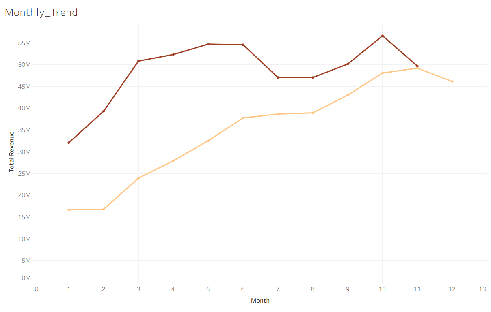
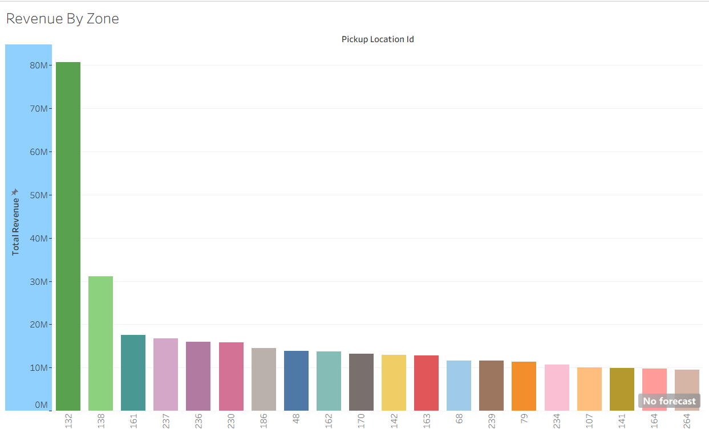
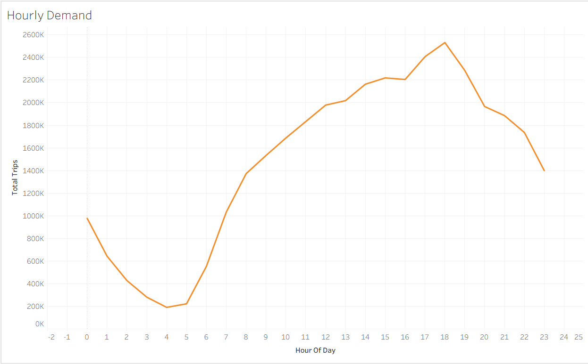
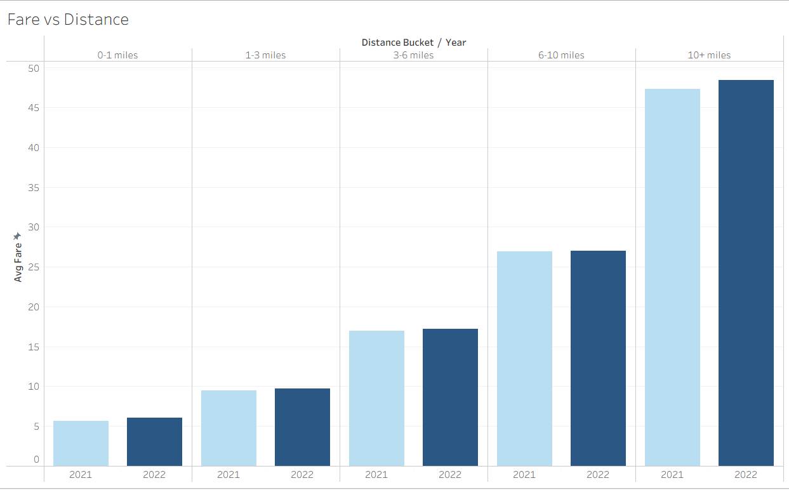
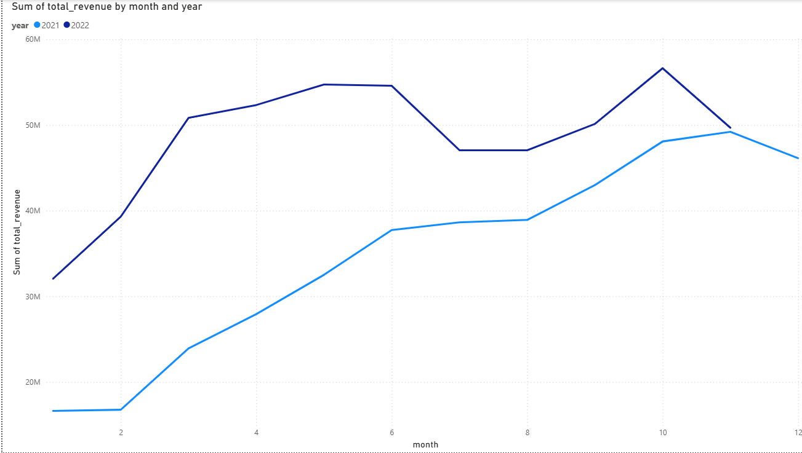
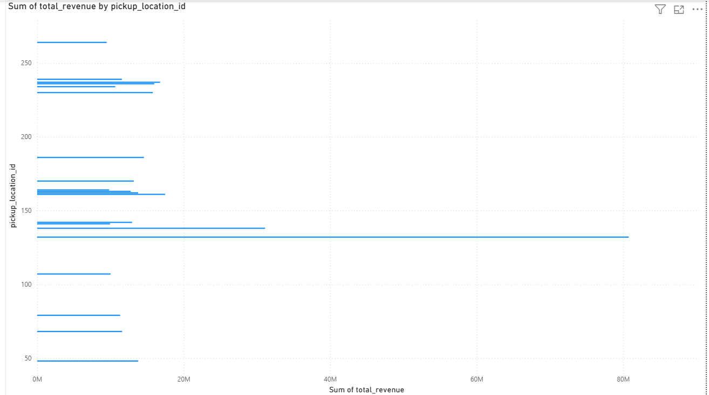
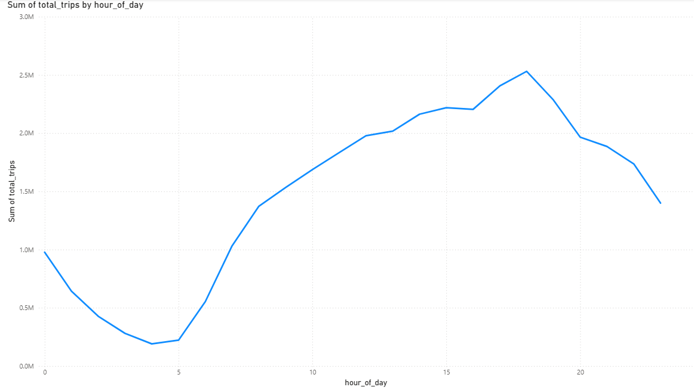
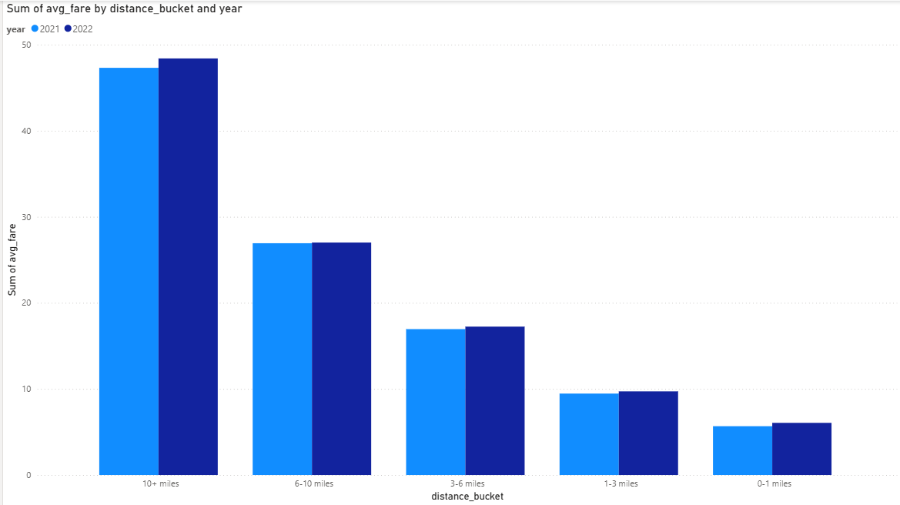

# NYC Taxi Business Analytics

## Overview
Analysis of 67M+ NYC Yellow Taxi trips (2021–2022) using BigQuery SQL,
visualized in Tableau Public and Power BI Desktop.

## Live Dashboard
[View on Tableau Public](https://public.tableau.com/app/profile/sushmit.kar/viz/NYCTaxiBusinessAnalytics)

## Tools
- Google BigQuery (SQL analysis)
- Tableau Public (dashboard + publishing)
- Power BI Desktop (dashboard)

## Structure
- `sql_queries/` — 8 BigQuery SQL queries
- `data/` — aggregated CSV outputs
- `NYC Taxi Business Analytics — Insights Report.pdf` — business report

## Dashboard figures

### Tableau Public
* Monthly Revenue Trend (2021–2022)

* Revenue by Pickup Zone

* Hourly Trip Demand

* Fare vs Distance (2021–2022)

### Power BI
* Monthly Revenue Trend (2021–2022)

* Revenue by Pickup Zone (2022)

* Hourly Trip Demand (2022)

* Fare vs Distance (2021–2022)

## Key Findings
- 2022 revenue 25–40% higher than 2021 across all months
- Zone 132 (JFK) generated $80M+ — highest of all zones
- Peak demand at 6PM; early morning trips average 44 miles (airport runs)
- Fares increased across all distance buckets YoY